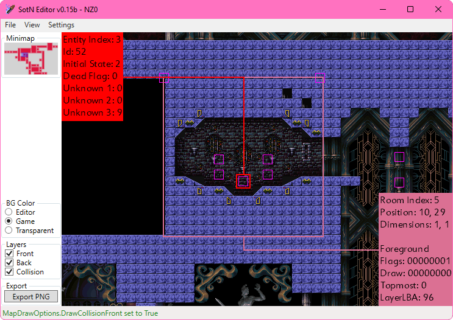

# Symphony of the Night Editor and Entity Recompiler

SNEER is a tool originally created by RHDN user Nyxojaele that is able to load and render maps from SotN. It was initially created back in 2010 and last updated in December 2012, with the most recent version being v0.15.

This repository is a working decompilation of the original SNEER v0.15 program with a few additions:
* Added an Export PNG button to export the map as a PNG file
* Added a transparent background option
* Rooms are now processed in reverse order to prevent issues caused by rooms overlapping
  * This causes weirdness with towers in `DAI.BIN`, but it fixes more than it breaks
    * I'll fix it eventually

Original SNEER forum thread: https://www.romhacking.net/forum/index.php?topic=11315.0

## Building

Requirements:
* Visual Studio
* [Microsoft .NET Framework 4](https://dotnet.microsoft.com/en-us/download/dotnet-framework)
* [Microsoft XNA Framework Redistributable 4.0](https://www.microsoft.com/en-us/download/details.aspx?id=20914)

1. Clone the respository. (`git clone https://github.com/KernelEquinox/SNEER.git`)
2. Open `SNEER.sln` in Visual Studio.
3. Build the solution.
4. The output binaries will be located in the `SNEER/bin/` directory.
